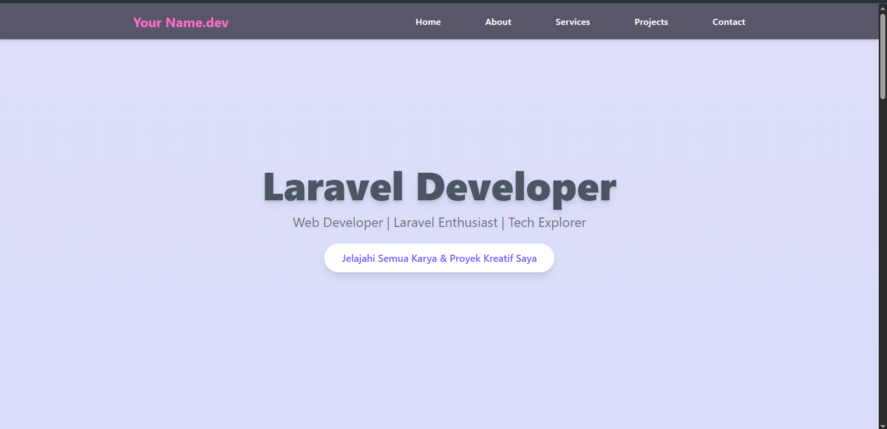

# 🌐 Firzi.dev – Portfolio Template (Static Version)

<p align="center">
  
</p>

<p align="center">
  <b>Elegant, responsive, and animated portfolio template built with HTML, TailwindCSS, and AOS.js.</b><br>
  🚀 Perfect for developers, freelancers, and creatives who want to showcase their work professionally.
</p>

<p align="center">
  <a href="https://dcoxer.github.io/website_portofolio/#projects" target="_blank"><b>🔗 Live Demo</b></a> •
  <a href="#-features"><b>✨ Features</b></a> •
  <a href="#-installation"><b>🛠️ Usage</b></a> •
  <a href="#-deployment"><b>🚀 Deployment</b></a> •
  <a href="#-license"><b>📄 License</b></a>
</p>

---

## ✨ Features

- 🎨 **Modern & Clean UI** – TailwindCSS powered design  
- 📱 **Fully Responsive** – Optimized for all devices  
- 🎬 **Smooth Animations** – Using AOS.js  
- 💼 **Portfolio Sections** – About, Services, Projects, Contact  
- ⚡ **Lightweight & Fast** – Static HTML, no backend required  

---

## 📂 Folder Structure

web_porto/
│── index.html # Main entry
│── /assets/ # CSS, JS, Images
│── preview.png # Template preview
└── README.md

## 🛠️ Usage (Local Preview)

```bash
# Clone this repository
git clone https://github.com/DcoXer/web_porto.git

# Open index.html in your browser
